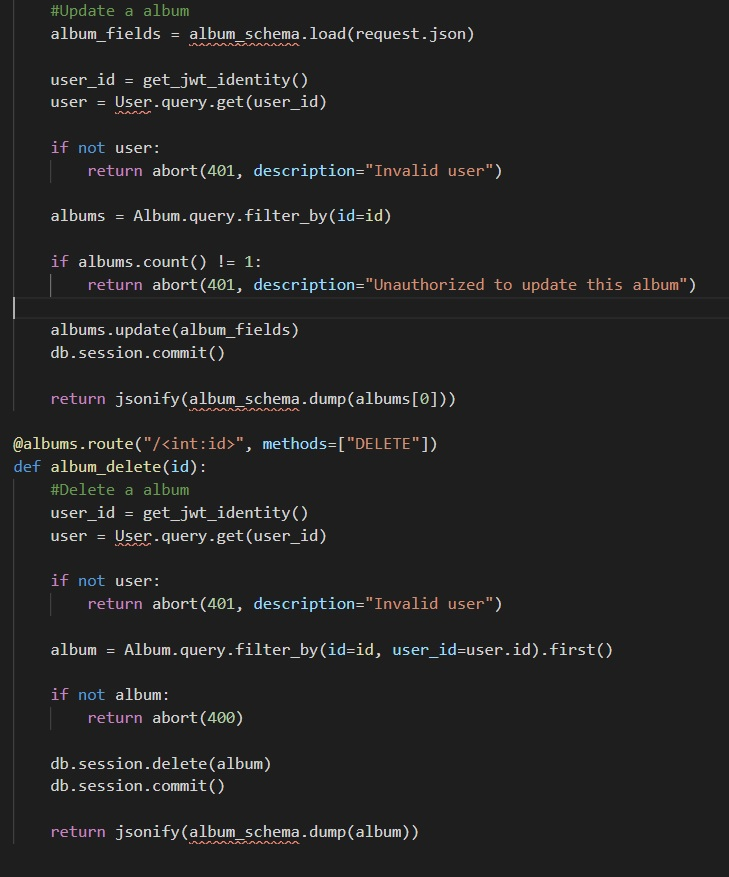
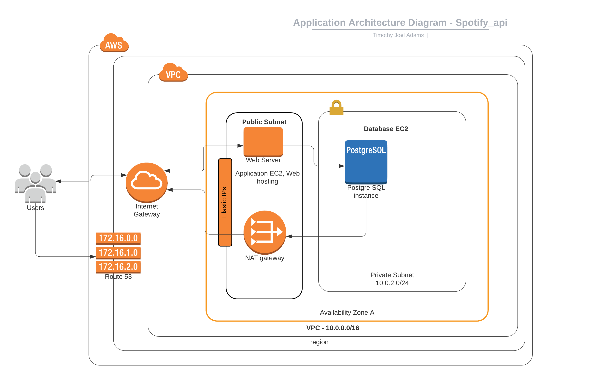

**Discuss how the application will handle the privacy of user data within the
system, and how security features of the frameworks you are utilising will
assist to mitigate security concerns.**

Example: discuss how the use of ORMs mitigate SQL injection attacks, and how API
frameworks such as ExpressJS can handle the sanitisation of user input.

The application will protect the privacy of user data a number of key ways.
Firstly, private information such as addresses, phone numbers, names and other
data will be stored in a PostgreSQL running on an Amazon AWS instance.
Additionally, passwords will not be stored directly on this database. Instead,
the passwords will be hashed using bcrypt, which converts the passwords to a
large number characters, in a non-random but difficult to penetrate format
through a complex algorithm. Although not truly 100% safe, the algorithm would
take more time to break than would be generally possible or undertaken by
attackers.

When a user signs up, their details are then stored in the database and there
are also protections in place to ensure that they can only modify or delete
records that they created themselves, this is done using JWT. Once signed up
they need to provide a Bearer Token along with their HTTP requests in order to
access the data. This is shown by the jwt_required code below:

As above if a user is not a valid user, they are shown the message, “Invalid
user”.

The application protects against SQL injections via use of Object Relational and
Schema Validation. This means that the users will never be able to access the
PostgreSQL database directly, they must instead use “routes” like shown above,
in conjunction with models and schemas which check the data input before any
changes or inputs can be made. These checks ensure that data for say a song
title, is only a “String” and not some other piece of code or injection.

The application is setup within the cloud and can be set up on two cloud
instances as per the diagram below. This means that the database itself does not
conduct direct inputs and outputs, and instead flows through the application
EC2, internet gateway and VPC. Running on AWS also provides a further layer of
protection in that AWS provides features such as security alerts and firewalls.

Report 1: Privacy and Security Report

Handling user data

Sensitive data like a user's email, phone number and password are collected and
stored in a PostgreSQL database within an AWS EC2 instance. To ensure the
original passwords do not get hacked, they are instead hashed using bcrypt (a
slow hashing algorithm) and stored as that hashed version in the database. This
hashing algorithm cannot be undone, meaning that the plain text password cannot
be discovered by any hacker, even if they get access to the database. If they
try a brute force attack by trying every conceivable password, the slow hashing
algorithm will ensure that it cannot be done within a reasonable time frame.
This mitigates the concern of users that their password may be discovered by a
hacker.

Whenever a user tries to create, update or delete data, they are required to
pass in a bearer token in the header of their HTTP request. This is because the
data belongs to a particular user and therefore we need to check that the data
does belong to the user. To check whether a particular bearer token belongs to a
particular user, the jwt_required decorator is used in combination with the
flask endpoint function.

**Discuss how you will address the following obligations as a developer:**

\- professional obligations (delivering the project on time, being explicit
about ongoing maintenance of the system)

\- ethical obligations: ensuring that the application conforms with ethical
codes of conduct approved by industry

\- legal obligations: that you have assessed whether the application is subject
to any legal regulation, if none, consider any privacy implications

As a developer I use a range of resources including Trello, MS Excel and a
calendar to manage my tasks required on projects. This enabled me to plan my
time and additionally provided a history of completed tasks. In terms of
maintenance my CI/CD pipeline requires that any changes to code be tested on a
virtual machine on an AWS EC2. Then automated tests are ran using Unit-Test to
ensure no errors are carried over to the final product.

In terms of ethical and legal obligations, we will ensure that personal
information of users is only stored with consent of the individuals. the Privacy
Act 1988 protects individuals’ personal information regardless of their age. The
Privacy Act does not stipulate an age by which an individual has capacity to
consent and although it is not feasible to assess this on a case-by-case basis,
we will endeavour not to store any information for users under the age of 15. In
line with the Privacy Act, we will endeavour to store users’ data with the
utmost security and abide by all laws relating to obligations of notification in
the event of any breach. We will also continually update our policy in terms of
data lifecycle, that is, ensuring old unrequired unused data is destroyed
confidentially. In accordance with the guidelines within the Privacy Act, we
will also endeavour to have security measures in place to have privacy concerns
written into all our designs.

We will also endeavour to have a procedure in place to monitor users’ input
content that is publicly visible an ensure that it is not harmful, illegal or
defamatory content.